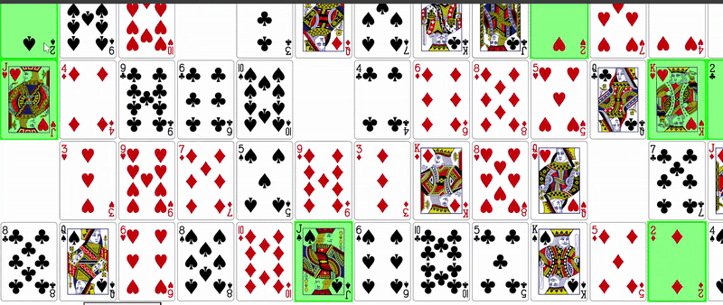

Addiction Solitaire – Projet Python

** Objectif du jeu **
Addiction Solitaire est un jeu de cartes classique adapté en version web avec Python (via Codeboot) et HTML. L’objectif est de disposer toutes les cartes, du 2 au Roi, dans l’ordre croissant et par couleur, sur une grille de 4 rangées et 13 colonnes.

On commence avec un jeu de 52 cartes, les 4 As sont retirés pour créer 4 trous sur la grille.
Le joueur peut déplacer les cartes selon les règles suivantes :
Un 2 ne peut aller que dans un trou de la première colonne.
Une carte de rang supérieur (3 à Roi) peut aller dans un trou à droite de la carte qui la précède et de même couleur (ex. : le 10♥ → trou à droite → Valet♥).
À chaque déplacement, un nouveau trou se crée à l’ancienne position de la carte.

** Mélanges (ou « brasses ») **
Si aucun déplacement n’est possible, le joueur peut choisir de brasser les cartes restantes.
Les cartes déjà bien placées restent fixes, et les autres sont mélangées avec les 4 As pour recommencer.
Le joueur ne peut brasser que 3 fois.

** Structure du projet **
solitaire.py : toute la logique du jeu (mélange, validation des coups, détection de victoire…).
solitaire.html : interface web.
codeboot.bundle.js & codeboot.bundle.css : environnement d’exécution Codeboot.
/cards/ : images SVG des cartes.
serveur.py : serveur local minimal pour exécuter le projet sans problème de CORS.

Toute la logique du jeu est codée en Python : règles, conditions de déplacement, détection de victoire/perte, gestion des brasses, etc.

Adaptation de l’affichage HTML avec mise à jour dynamique via le bundle Codeboot.

** Exemple de partie: **

