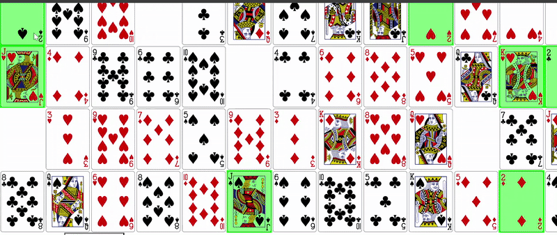

# Addiction Solitaire 🃏

[](https://www.python.org/)
[](https://en.wikipedia.org/wiki/HTML5)
[](https://codeboot.org/)

Une adaptation moderne et web du célèbre jeu de cartes **Addiction Solitaire**. Ce projet combine la puissance logique de **Python** avec une interface utilisateur **HTML/CSS** dynamique, propulsée par l'environnement Codeboot.

---

##  Objectif du Jeu

L'objectif est de réorganiser un jeu de 52 cartes sur une grille de **4 rangées et 13 colonnes**. Le joueur doit disposer toutes les cartes, du **2 au Roi**, dans l'ordre croissant et par couleur (ex: 2♥, 3♥, 4♥... Roi♥).

---

##  Mécaniques de Jeu

### Règles de Déplacement
* **Ouverture :** Les 4 As sont retirés en début de partie pour créer 4 emplacements vides (trous).
* **Colonnes de départ :** Un **2** ne peut être placé que dans un trou situé dans la première colonne.
* **Séquence logique :** Une carte (de 3 à Roi) peut être placée dans un trou uniquement si la carte à gauche du trou est de la **même couleur** et de **rang immédiatement inférieur** (ex: le 10♥ peut être placé à droite du 9♥).
* **Dynamique :** Chaque déplacement libère un nouvel emplacement à l'ancienne position de la carte.

### Le Système de "Brasses" (Mélange)
Lorsqu'aucun déplacement n'est possible, le joueur dispose de **3 mélanges (brasses)** :
* Les cartes déjà correctement placées restent **fixes**.
* Toutes les autres cartes sont ramassées, mélangées avec les 4 As, puis redistribuées pour débloquer la situation.

---

##  Architecture du Projet

Le projet est structuré pour séparer la logique métier de la couche de présentation :

* **`solitaire.py`** : Le moteur du jeu. Contient toute la logique algorithmique (mélange, validation des coups, détection de victoire/perte, gestion des états).
* **`solitaire.html`** : L'interface utilisateur. Gère l'affichage de la grille et les interactions visuelles.
* **`/cards/`** : Bibliothèque d'assets contenant les images SVG haute résolution pour chaque carte.
* **`serveur.py`** : Un serveur local minimaliste permettant de contourner les restrictions CORS lors de l'exécution locale.
* **`codeboot.bundle.js/css`** : Dépendances de l'environnement d'exécution Codeboot.

---

## Installation et Lancement

1.  **Cloner le dépôt :**
    ```bash
    git clone [https://github.com/CFMateo/addiction-solitaire.git](https://github.com/CFMateo/addiction-solitaire.git)
    cd addiction-solitaire
    ```

2.  **Lancer le serveur local :**
    ```bash
    python serveur.py
    ```

3.  **Jouer :**
    Ouvrez votre navigateur et accédez à `http://localhost:8000/solitaire.html`.

---

## Fonctionnalités Techniques

* **Mise à jour dynamique :** Synchronisation en temps réel entre l'état de la logique Python et le DOM HTML via Codeboot.
* **Algorithme de validation :** Vérification instantanée de la légalité de chaque mouvement.
* **Gestion d'état :** Suivi précis des cartes fixes vs mobiles lors des phases de mélange.
* **Design Responsive :** Grille de cartes adaptative pour une expérience de jeu fluide.

---
*Projet développé pour démontrer l'intégration de Python dans un contexte de développement web interactif.*


** Exemple de partie: **




